# 小芽智趣岛当前版本全玩法体验报告

- 体验日期：2026-08-05
- 版本：`sprout-playland 3.8.8`，Cocos Creator 浏览器预览
- 体验画面：Apple iPhone 14 Pro 横屏模拟，游戏画布约 852 × 393（项目设计分辨率 1334 × 750）
- 目标用户：2～5 岁儿童
- 体验样本：所有玩法、所有难度；每类玩法统一选用首关“小芽和太阳”以便横向比较

## 一句话结论

除拼图外，四个新小游戏已经形成了完整、稳定、对低龄儿童友好的“选关—操作—反馈—奖励”闭环；当前最需要先处理的是**拼图视觉上完成后没有触发结算、也没有记录星级**，其次是 16 块拼图的碎片堆叠过密，以及首页第五个玩法只能靠滑动发现。

## 测试矩阵

| 玩法 | 难度 | 实际体验 | 结果 |
| --- | --- | --- | --- |
| 欢乐拼图 | 4 块 / 常规 | 完整拖完 4 块，检查吸附、错误容忍与进度 | **异常：画面拼合但无结算、无星级** |
| 欢乐拼图 | 9 块 / 六边形 | 进入并拖动、检查碎片辨认与吸附 | 基础交互可用，碎片开始拥挤 |
| 欢乐拼图 | 16 块 / 圆形 | 进入并拖动、检查密度与触控可辨性 | 可启动，但对 2～5 岁偏难且堆叠过密 |
| 擦擦发现 | 简单 | 擦除至完成 | 通过，1 星结算 |
| 擦擦发现 | 普通 | 擦除至完成 | 通过，2 星结算 |
| 擦擦发现 | 困难 | 擦除至完成 | 通过，3 星结算 |
| 恐龙配对 | 简单 | 错误放置、正确配对并完成 | 通过，1 星结算 |
| 恐龙配对 | 普通 | 完成 2 组交叉配对 | 通过，2 星结算 |
| 恐龙配对 | 困难 | 完成 3 组交叉配对 | 通过，3 星结算 |
| 泡泡找找 | 简单 | 错点、完成 2 个连续目标 | 通过，1 星结算 |
| 泡泡找找 | 普通 | 完成 3 个目标、每轮 5 个泡泡 | 通过，2 星结算 |
| 泡泡找找 | 困难 | 完成 3 个目标、每轮 6 个泡泡 | 通过，3 星结算 |
| 恐龙翻翻 | 简单 | 完成 2 对卡片 | 通过，1 星结算 |
| 恐龙翻翻 | 普通 | 完成 3 对卡片 | 通过，2 星结算 |
| 恐龙翻翻 | 困难 | 完成 4 对卡片 | 通过，3 星结算 |

浏览器控制台在整轮体验中没有出现 error 或 warn。

## 体验步骤与健康度

### 1. 首页与玩法发现 — 需优化

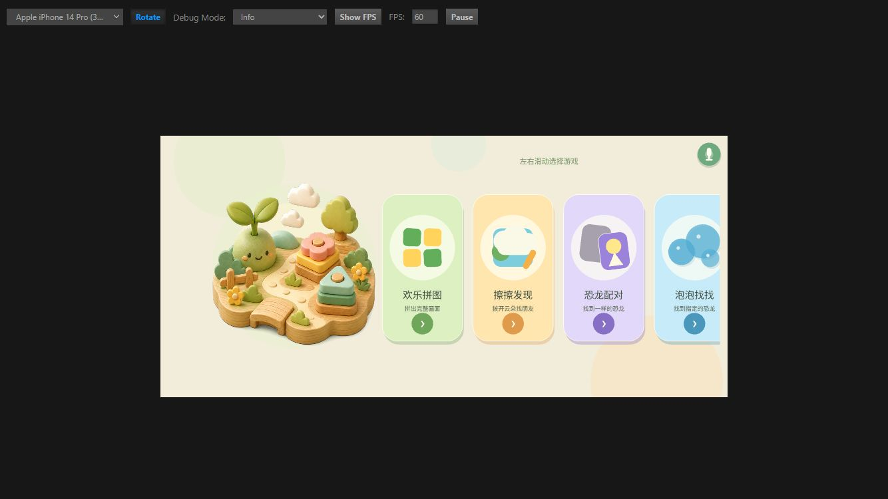

优点：五类玩法拥有清晰的专属配色和图形符号，卡片足够大，画面气质温和统一。

问题：首屏只能完整看到前三个入口和第四个入口的一部分，“恐龙翻翻”必须向左滑动后才能看到。当前主要提示是顶部的“左右滑动选择游戏”，对不识字的低龄儿童不够可靠。实际体验中需要先理解这是横向轨道，才能发现第五个玩法。

建议：首次进入时给卡片轨道一次非常轻的自动位移回弹，或增加非文字分页点/拖动手势动画；仍保留右侧半张卡片作为“还有内容”的视觉暗示。

### 2. 选关与难度选择 — 健康

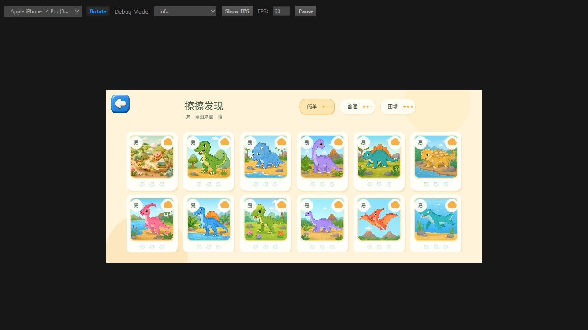

12 张关卡缩略图加载完整，四个小游戏的选关结构一致；简单、普通、困难同时用文字和 1～3 个圆点表达，选中态有边框和底色变化，记忆成本低。

风险：难度文字和卡片底部星级在手机画布中偏小，家长看得清，儿童未必会关注。核心操作不依赖这些文字，因此目前不构成阻塞。

### 3. 欢乐拼图 — 阻塞发布

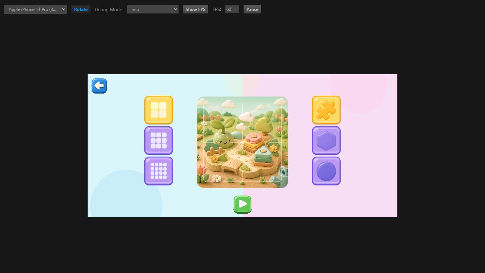

设置页的块数、外形、开始按钮都能仅凭图形理解，符合“不依赖识字”的原则；4 块拼图尺寸大、拿起与吸附手感清楚，拼齿和 2.5D 厚度也能帮助辨认。

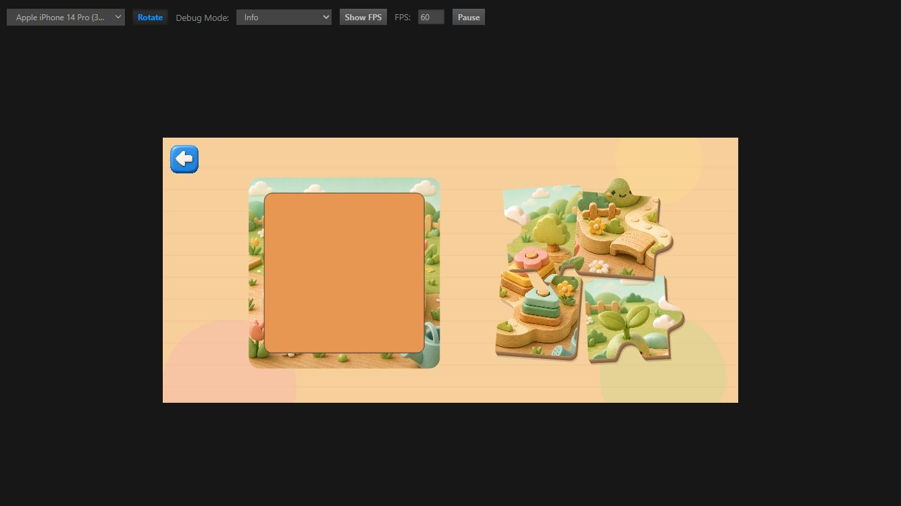

本轮把 4 块全部拖到正确位置后，画面已经视觉拼合，但等待超过 7 秒仍没有出现庆祝动画或完成弹窗；退出后回到关卡页，第一关星级仍为空。控制台没有报错。该现象说明最后一次吸附与“全部完成”的状态之间存在断点，或者有拼块停在视觉正确、逻辑未完成的状态。

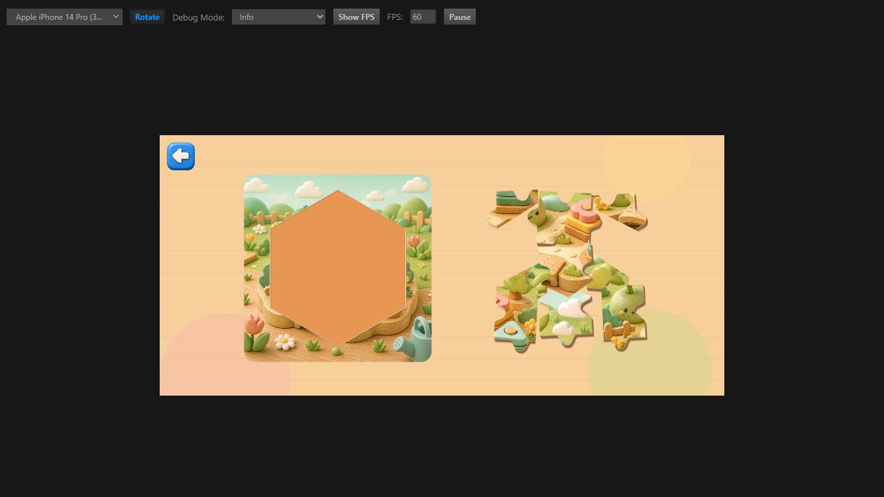

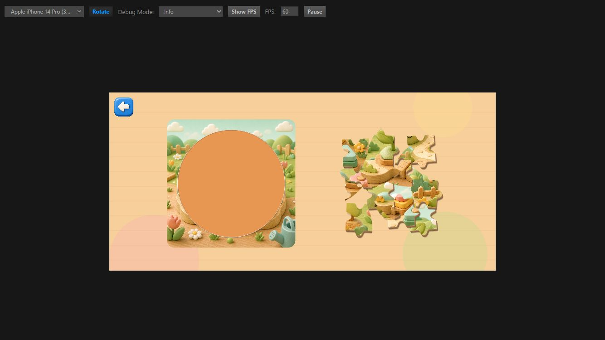

9 块开始出现明显遮挡；16 块的有效可见区域和可触摸区域都被其他拼块覆盖，幼儿很难通过图片内容辨认某一块，也容易重复抓到上层碎片。六边形和圆形模式在画面上表现为“整体拼图区外形改变”，但选择图标可能让人预期“单块会变成六边形/圆形”，语义存在轻微偏差。

建议优先级：

1. 先修复 `全部拼块吸附 → 庆祝 → 弹窗 → 星级写入` 的完整链路，并为 4/9/16 块 × 3 种外形增加完成回归测试。
2. 16 块采用更松散的两层托盘、分页或可横向拖动的碎片区，保证每块至少有一半轮廓始终可见。
3. 在外形按钮上补充整体轮廓的小型预览动画，避免把“拼图区形状”理解成“单块形状”。

### 4. 擦擦发现 — 健康，当前完成度最高

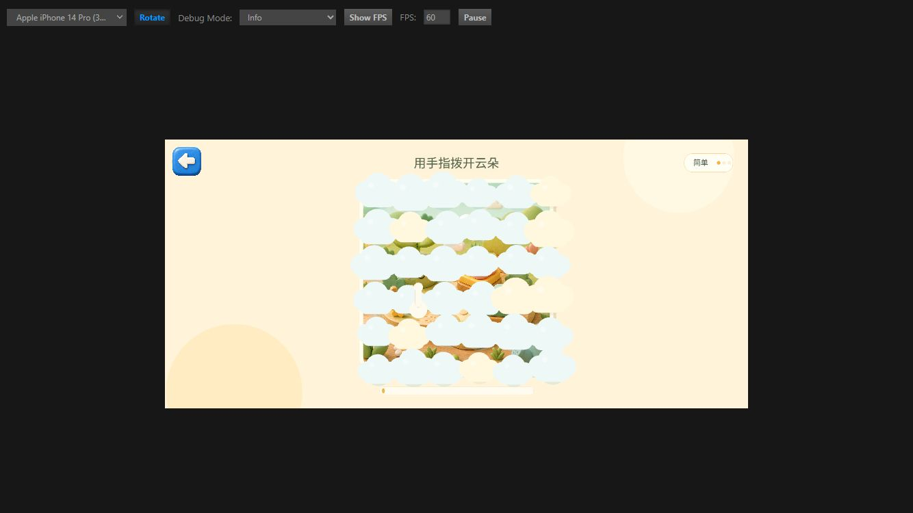

简单、普通、困难分别通过云朵数量、擦除半径和完成阈值递进。三档都能明显感到差异，但困难档仍然可以用连续扫动顺畅完成，没有无效劳动感。云朵淡出、进度条和最终完整画面形成了很好的即时反馈。

建议：保留当前难度曲线；可以让底部进度条更粗一点，或在接近完成时加入轻微发光，让儿童更容易感知“快完成了”。

### 5. 恐龙配对 — 健康

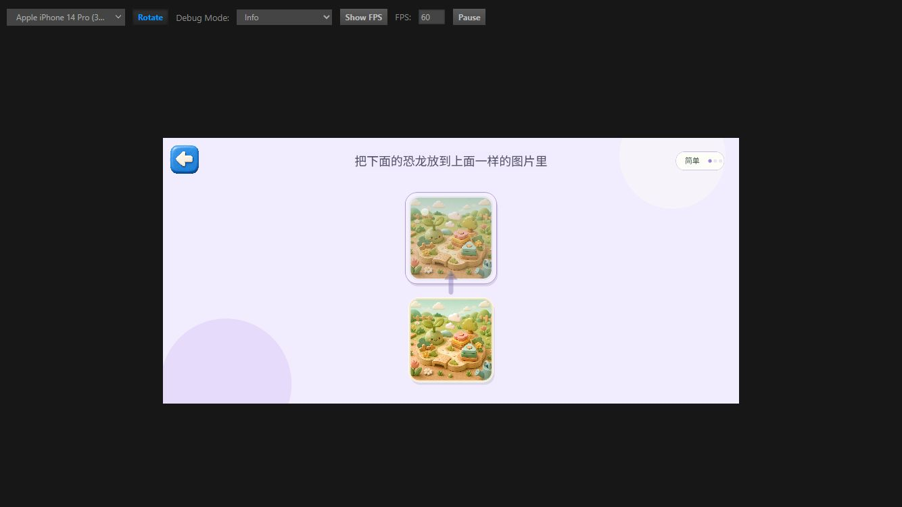

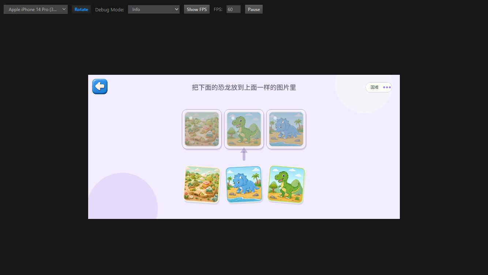

简单 1 组、普通 2 组、困难 3 组，递进直接；目标图保持淡色、待拖卡保持鲜艳，拖错后柔和回位，没有红叉或扣分。困难档仍保持较大的图片和足够间距，适合触摸。

小问题：错误回位主要依靠位置变化，缺少一个更明确但不惩罚的视觉提示。可以在正确目标上短暂柔和闪烁，帮助儿童理解“要找一样的”。

### 6. 泡泡找找 — 健康，但错误反馈偏弱

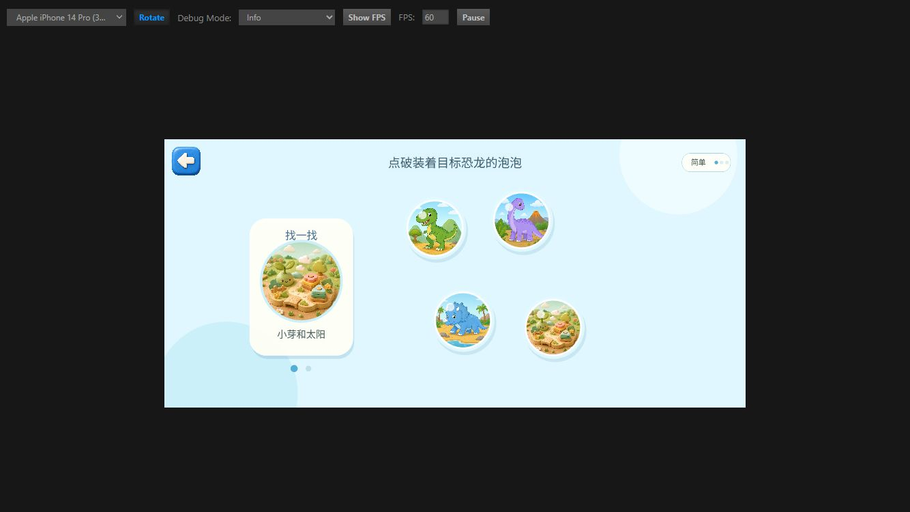

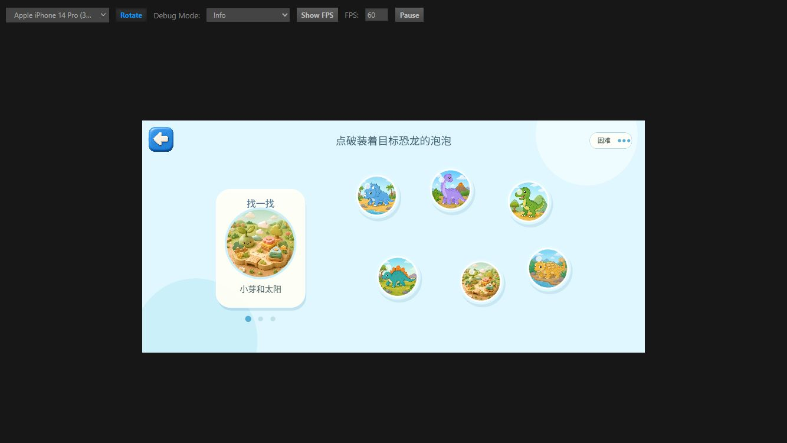

目标卡固定在左侧，泡泡内容足够清楚；简单 4 个泡泡/2 个目标，普通 5 个泡泡/3 个目标，困难 6 个泡泡/3 个目标，难度主要来自干扰项数量和泡泡尺寸，递进合理。每次找对都会刷新下一目标，底部圆点能表达局内进度。

错误点击没有惩罚是对的，但当前摇晃很短、幅度也小，静态截图几乎看不出差异。建议增加一圈短暂的水波纹或泡泡软弹，让儿童知道“点到了，但不是这个”，不要增加红色、叉号或失败音。

### 7. 恐龙翻翻 — 健康

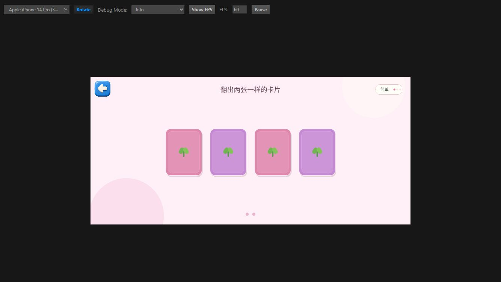

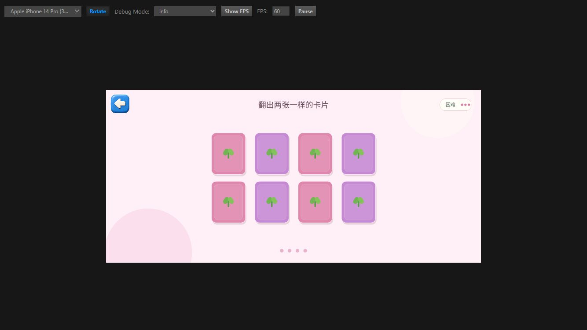

2、3、4 对卡片的难度变化非常直观；翻牌动画简洁，错配会保留足够时间观察后再翻回，配对成功则保持正面。困难档 8 张卡仍保持规整的 4 × 2 网格，触控目标没有过度缩小。

需要留意的是，卡片内容下方的名称文字很小，但玩法本身不依赖读字。若后续加入语音，可在翻开时读出恐龙名称，强化认知价值。

### 8. 完成奖励与下一步 — 基本健康

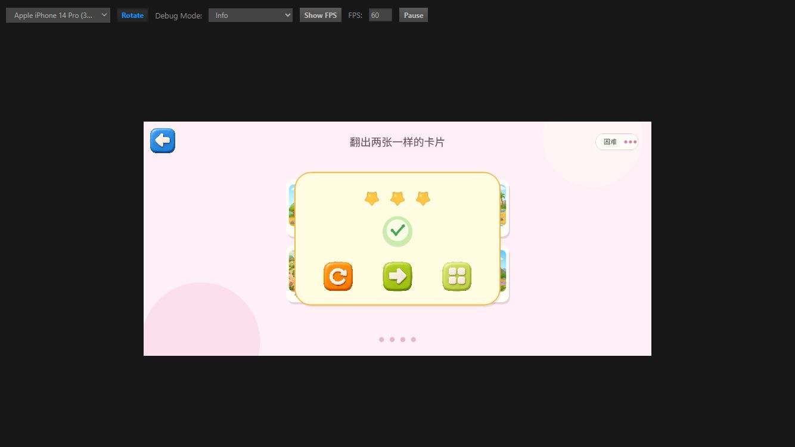

四个新小游戏的完成弹窗完全一致，星数与难度对应，重玩、下一关、回选关三条路径都很容易点击。统一性很好。

风险：三个按钮都是纯图标，绿色右箭头对成人容易理解，对幼儿可能同时代表“继续”或“退出”。可以通过首次使用时的轻微引导动画、语音或按钮空间位置加强含义，不必强制加文字。

## 最高优先级问题

1. **P0：拼图完成链路失效。** 视觉拼合后不结算、不记录星级；这会直接破坏核心奖励闭环。
2. **P1：16 块拼图碎片堆过密。** 轮廓和内容大面积互相遮挡，实际抓取选择成本过高。
3. **P1：首页第五个玩法发现成本高。** 依赖文字提示和滑动经验，不符合完全无识字依赖的目标。
4. **P2：泡泡找找错误反馈过轻。** 不惩罚是优点，但需要更容易察觉的柔和反馈。
5. **P2：完成弹窗纯图标语义仍可增强。** 通过动画或语音补足即可，不建议堆文字。

## 可访问性与真机验证限制

- 浏览器预览中的游戏是单一 Canvas，DOM 中没有游戏按钮、标签或阅读顺序；因此无法从本轮确认读屏器语义。微信小游戏若需要无障碍支持，需要另外设计可访问层或语音路径。
- 本轮使用鼠标模拟触摸，不能替代 2～5 岁儿童的手指精度、握持遮挡和连续拖动测试。
- 没有验证微信真机的安全区、低端机帧率、首次资源加载、触摸延迟、音效音量与自定义语音权限。
- 本轮用同一张关卡图横向比较所有玩法；选关页确认了其余缩略图均正常加载，但没有逐张完成所有素材关卡。

## 建议的下一轮验收

先只针对拼图做一轮 9 个组合（4/9/16 块 × 常规/六边形/圆形）的完成回归，确认每个组合都能触发庆祝、弹窗和星级保存；通过后再安排 2～5 岁儿童真机观察，重点记录首页滑动发现率、16 块拼图停顿位置和泡泡误点后的理解情况。
