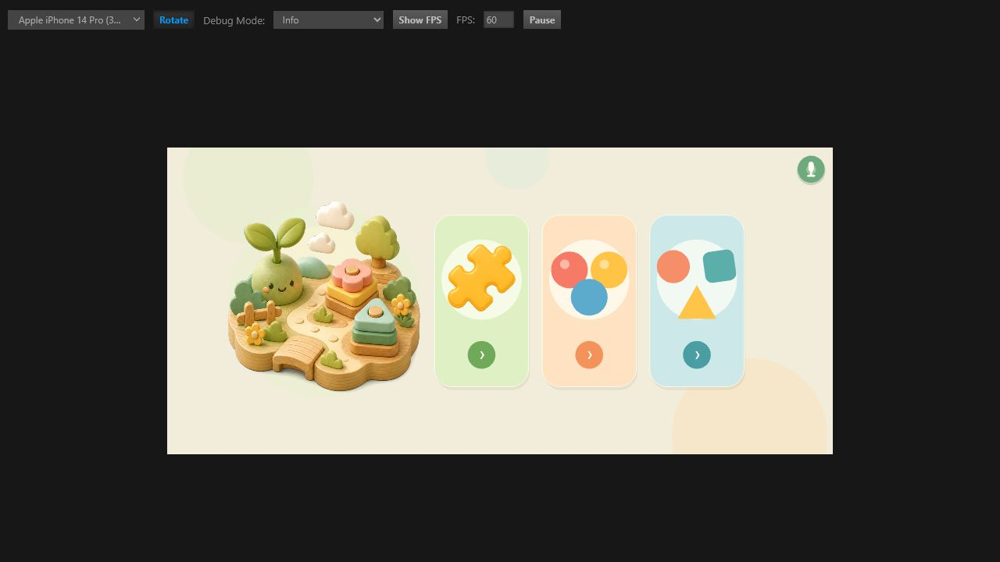
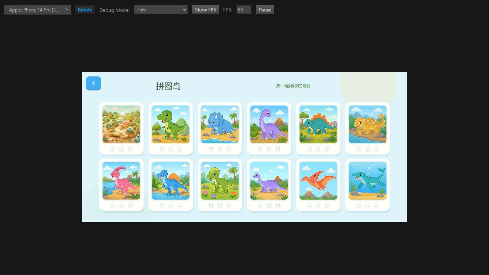
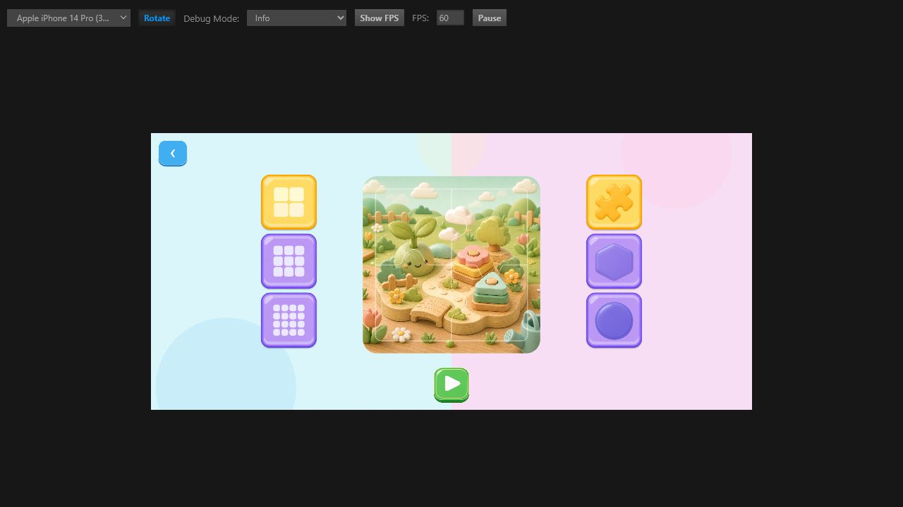
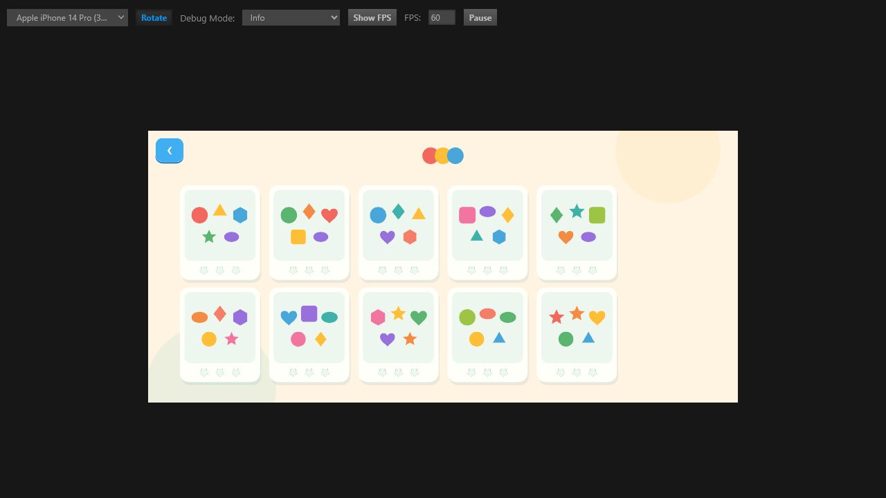
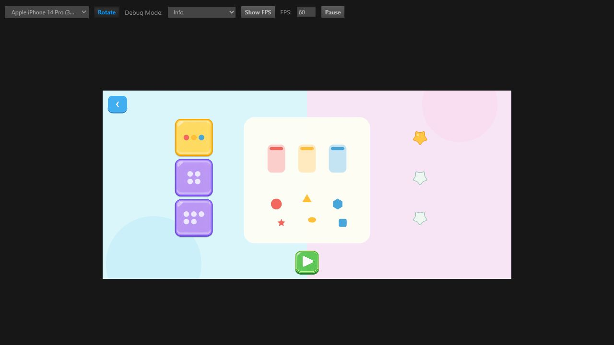
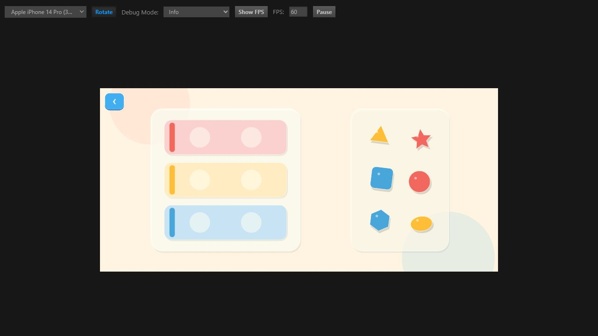
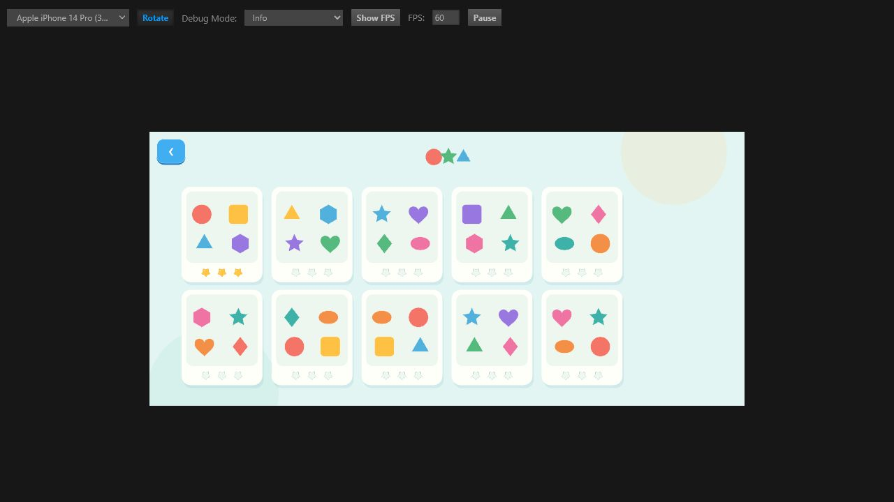
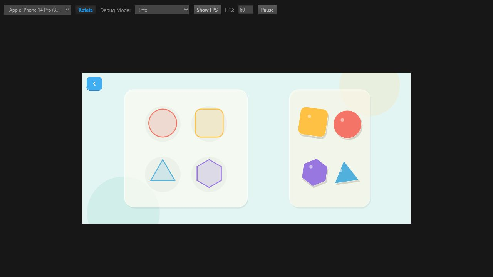

# 颜色与形状游戏 UI / 流程审查

## 审查范围

- 用户目标：儿童从首页识别游戏类型，尽快进入玩法，并通过卡片星级理解进度。
- 对比范围：首页、拼图关卡与难度页、颜色关卡/难度/玩法、形状关卡/难度/玩法。
- 证据限制：本次基于 Cocos Web 预览截图，未覆盖不同设备尺寸、色觉模拟、键盘与读屏体验。

## 总体结论

颜色和形状游戏虽然复用了拼图的页面结构，但没有复用拼图最重要的“内容感”和“玩具感”。目前的关卡卡片只是同一批基础图形的排列变化，进入详情页后又再次选择数量，因此形成了两次含义接近的选择。建议保留关卡列表，删除颜色和形状的独立难度详情页，让关卡卡片直接开始下一档未完成难度。

## 流程步骤

### 1. 首页 — 良好

- 三个入口的位置、尺寸和色块结构一致，儿童可以靠图形识别。
- 颜色与形状入口的图标仍偏“教学分类”，拼图入口更像真正的玩具和游戏。

### 2. 拼图关卡列表 — 良好

- 每张卡片都有明确、不同的恐龙画面，选择关卡等于选择想玩的内容。
- 大图缩略图、白色卡框、星级进度形成了清楚的视觉层次。

### 3. 拼图难度页 — 基本合理

- 中央完整图片能确认选择，左右按钮分别改变拼图数量和拼块造型，选择有实际意义。
- 页面按钮有较强的立体玩具质感，但左右两组选择仍需要儿童通过图形自行理解。

### 4. 颜色关卡列表 — 较弱

- 卡片布局和星级位置与拼图一致，这是可保留的统一基础。
- 关卡仅是颜色与图形重新排列，缩略图之间缺少真正的内容差异；儿童不知道为什么要选其中某一张。
- 小图形面积过小、留白较多，整体显得像练习题，不像玩具卡片。

### 5. 颜色难度页 — 冗余

- 关卡选择之后又选择 3/4/5 种颜色，多了一次开始前操作。
- 中央预览由细小图形组成，与拼图的大幅插画相比视觉重心弱，右侧星星与内容联系不强。
- 建议删除此页：点击关卡卡片后，根据已有星级直接开始下一档难度。

### 6. 颜色玩法 — 结构清楚，表现力不足

- 左目标、右拼块的空间关系清楚，触摸目标尺寸足够大。
- 大面积浅色槽和白色面板层次偏淡，玩具缺少主题场景与角色反馈。
- 只用颜色表达正确关系，对色觉差异儿童不够友好；应同时加入图案、角色或纹理提示。

### 7. 形状关卡列表 — 较弱

- 与颜色列表的问题相同：十张卡片只是基础图形组合变化，没有可期待的关卡主题。
- 图形列表与首页图标过于接近，进入列表后没有产生“发现新内容”的感觉。

### 8. 形状难度页 — 冗余

- 关卡选择和数量选择表达的是同一个“接下来玩多少个图形”，流程重复。
- 中央轮廓较细、对比度偏低，右侧星级距离主体较远。
- 建议与颜色游戏一样取消此页，关卡卡片直接进入下一档难度。

### 9. 形状玩法 — 可用，但像原型

- 轮廓与拼块一一对应，玩法无需文字说明。
- 目标区轮廓和底板对比度较弱，形状只是孤立排列，缺少拼图游戏那种完成一幅作品的成就感。
- 可将目标设计成由多个形状组成的机器人、火箭、动物或城堡，完成后出现完整场景。

## 优先建议

1. 删除颜色和形状的独立难度页：卡片点击后直接开始；0/1/2 星自动进入简单/中等/困难，3 星卡片默认重玩困难。
2. 保留拼图式关卡卡片和三星进度，但把每张卡片改成有明确主题的场景缩略图，而不是随机排列基础图形。
3. 颜色关卡可使用气球、颜料罐、鱼群、花园、玩具车等主题；形状关卡可使用机器人、火箭、城堡、动物、交通工具等组合目标。
4. 游戏内统一使用拼图的白色厚卡框、柔和阴影、圆角和完成庆祝节奏；降低空白感，增强主体尺寸。
5. 颜色匹配增加纹理或小图案作为第二提示；形状轮廓加粗并提高对比度。

